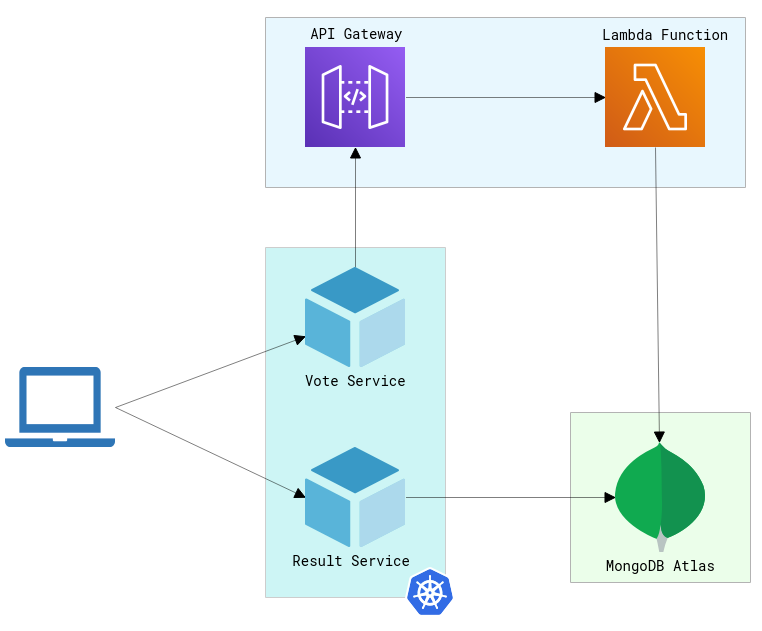

# Deploy a Development Environment with Microservices, Lambda Functions, and MongoDB Atlas

This is an example of how to configure and deploy a development environment that includes polyglot microservices, an AWS lambda function, and uses MongoDB Atlas for storage.

## Architecture



* A frontend web app in [Java](/vote) which lets you vote between Tacos and Burritos
* A [Node.js](/result) webapp which shows the results of the voting in real time
* A [Python-based AWS Lambda Function](/worker) worker which receives votes from /vote and stores them in a MongoDB Atlas instance
* A MongoDB Atlas cluster that stores everything


## Run the demo application in Okteto

### Prequisites:
1. An AWS account
2. A [MongoDB Atlas](https://www.mongodb.com/docs/atlas/getting-started/) account
3. [Deploy a free cluster](https://www.mongodb.com/docs/atlas/tutorial/deploy-free-tier-cluster/) in your MongoDB Atlas account
4. Create a set of IAM keys for your AWS account
5. Create the following Okteto secrets:

    - MONGODB_USERNAME: Your MongoDB Atlas username
    - MONGODB_PASSWORD: Your MongoDB Atlas username
    - MONGODB_DATABASE: The name of your MongoDB Atlas cluster
    - MONGODB_HOST: The URL of your MongoDB Atlas cluster
    - AWS_ACCESS_KEY_ID: The Acces Key ID of your IAM user.
    - AWS_SECRET_ACCESS_KEY: The Secret Acces Key of your IAM user.

> If you are using Okteto Self-Hosted, you can configure your instance to use an AWS role instead of using an Acess Key and Secret Access Key.

Once this is configured, anyone with access to your Okteto instance will be able to deploy an development environment automatically, including the required cloud infrastructure.


```
$ git clone https://github.com/okteto/microservices-demo
$ cd microservices-demo
$ okteto login
$ okteto deploy
```

## Develop on the Result microservice

```
$ okteto up result
```

## Develop on the Vote microservice

```
$ okteto up vote
```

## Notes

This isn't an example of a properly architected perfectly designed distributed app... it's just a simple
example of the various types of pieces and languages you might see (queues, persistent data, etc), and how to
deal with them in Okteto.
